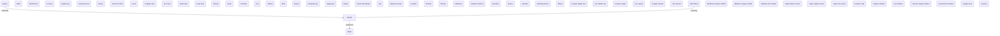

# Resource flows
This document houses the mermaid diagrams for the resource flows.

## Children of the Spirits

```mermaid
graph TD;
%% Raw renewable
	Game(Game);
	Herb(Herb);
	Mushroom(Mushroom);
	FirTree(Fir tree);
	AppleTree(Apple tree);
	ChestnutTree(Chestnut tree);
	Grass(Grass);
	FishingGround(School of fish);

%% Raw limited
	Rock(Rock)
	VeinCopper(Copper Vein)
	VeinIron(Iron Vein)
	VeinGold(Gold Vein)
	CoalVein(Coal Vein)

%% Livestock
	Sheep(Sheep)
	Oxen(Oxen)
	Chicken(Chicken)
	Pig(Pig)

%% Produce
	Wheat(Wheat)

%% Food
	Meat(Meat)
	Fish(Fish)
	Bread(Bread)
	PieChestnut(Chestnut pie)
	PieApple(Apple pie)
	Mead(Mead)
	MeadFlavoured(Flavoured Mead)
	Ale(Ale)
	AleFlavoured(Mushroom Ale)

%% Material
	Lumber(Lumber)
	Boards(Boards)
	Stones(Stones)

%% Goods
	Medicine(Medicine)
	ClothesWool(Woolen clothes)
	Candles(Candles)
	Shoes(Shoes)

%% Luxury
	JewelryGold(Jewelry)
	DrinkingHorns(Drinking Horns)
	Pillow(Pillow)

%% Weapons
	BattleAxeCooper(Cooper battle axe)
	BattleAxeIron(Iron battle axe)
	SpearCopper(Cooper spear)
	SpearIron(Iron spear)
	SwordCopper(Copper Sword)
	SwordIron(Iron Sword)
	BowShort(Short Bow)
	MediumShieldWood(Medium wooden shield)
	MediumShieldCopper(Medium copper shield)
	MediumShieldIron(Medium iron shield)
	LightArmorLeather(Light leather armor)
	LightArmorCopper(Light copper armor)
	LightArmorIron(Light iron armor)
	LightHelmetLeather(Leather cap)
	MediumHelmetCopper(Copper helmet)
	MediumHelmetIron(Iron helmet)
	MediumHelmetCopperHorned(Horned copper helmet)
	MediumHelmetIronHorned(Horned iron helmet)

%% Tools
	AxeCopper(Copper Axe)
	AxeIron(IronAxe)

%% Buildings
%% Vikings
	Hunter[Hunter]

	Game--Killed by-->Hunter
	BowShort--Used by---Hunter
	Hunter--produces-->Meat
```
